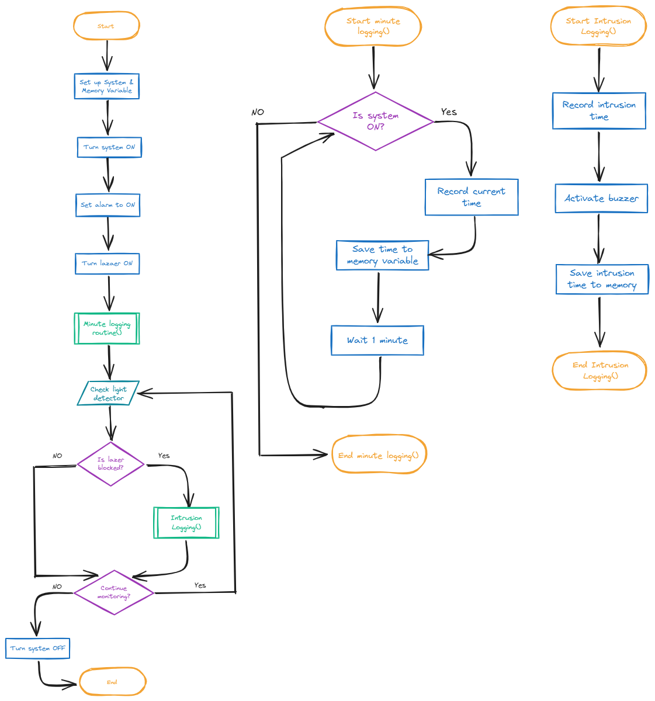

# Assessment Task 2: MECHATRONICS DOCUMENTATION
## Requirements Outline

### Defining the Purpose
-------- The Need --------

Living in a multiple story home means I spend a lot of time downstairs, leaving my upstairs bedroom unattended. Family members, guests and friends regularly go upstairs and enter my room without warning. Because I am on a different floor, I cannot see or hear when someone enters my space leaving me unaware. This has caused a big issue with privacy as people often disturb my room layout and touch valuable items without me knowing.

-------- Proposed Solution --------

An open loop security system shines a laser into a light detector triggering a buzzing noise and records the time if someone enters the room and blocks the beam. To stop someone from unplugging the device, it logs the time every minute to a single variable. Every new minute it deletes and replaces the previous time in the memory. This means if the system is turned off the memory still retains the very last time it was active, letting you know exactly when it stopped working.

### Key Actions
 - Password system to turn the mechanism on/off.
 - Laser shines into a light detector triggering a buzzing noise.
 - Records the time a person enters.
 - Every minute it deletes and replaces the previous time in the memory.
 - Memory retains the very last time it was active

### Functional Requirements

### Non-Functional Requirements

## Algorithms

### Flowchart (Two Subroutines and Mainline Routine)

